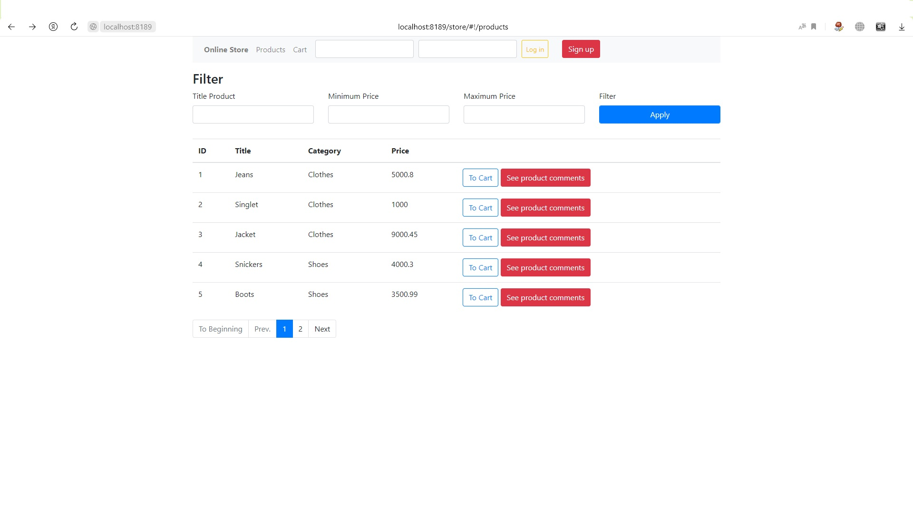
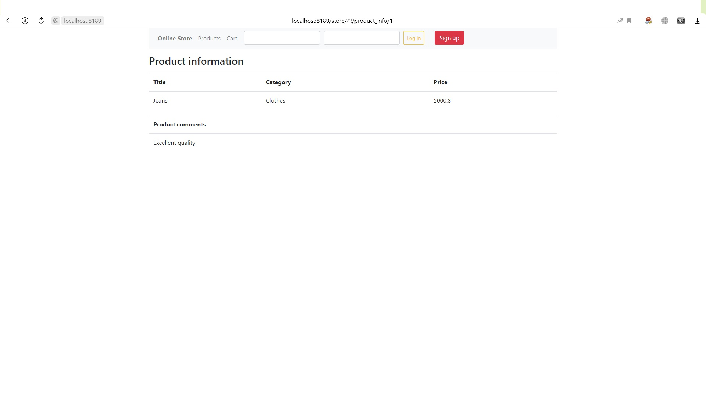
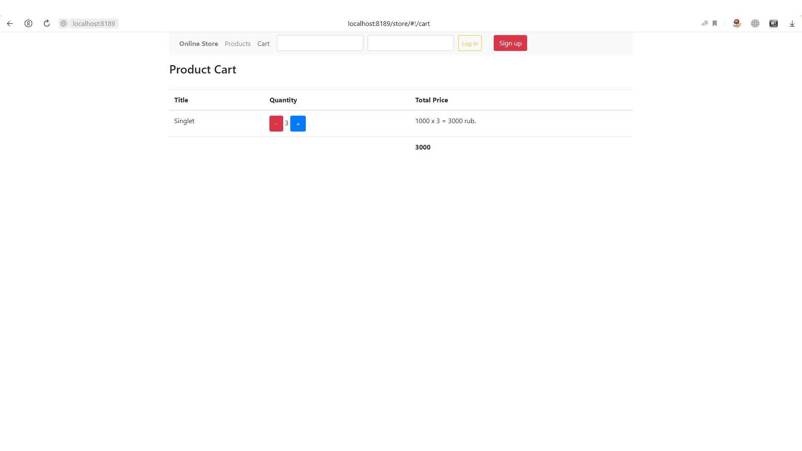
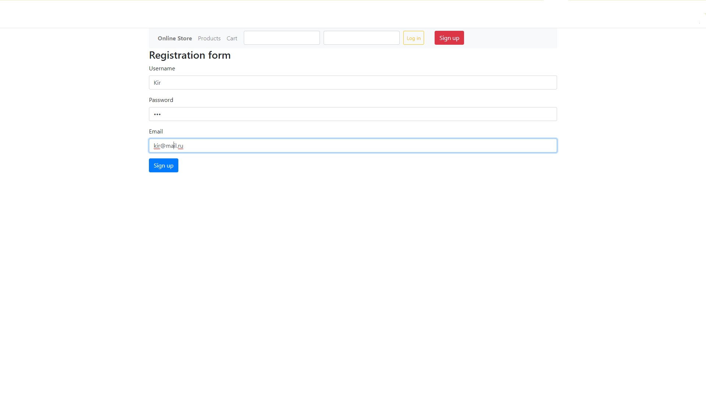
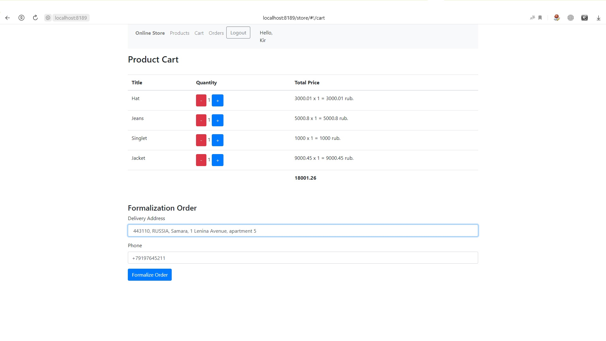
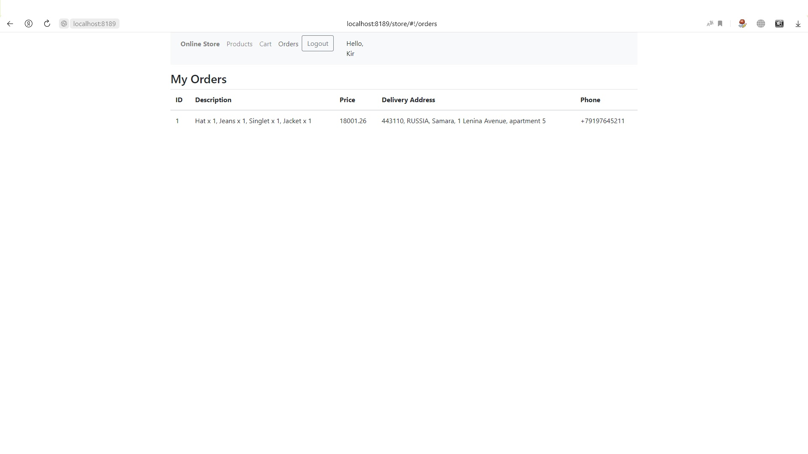
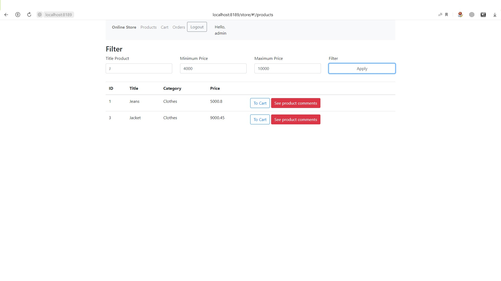
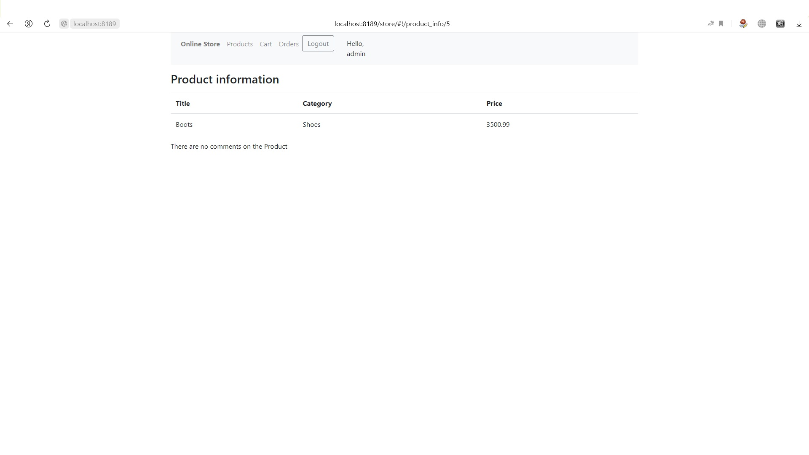
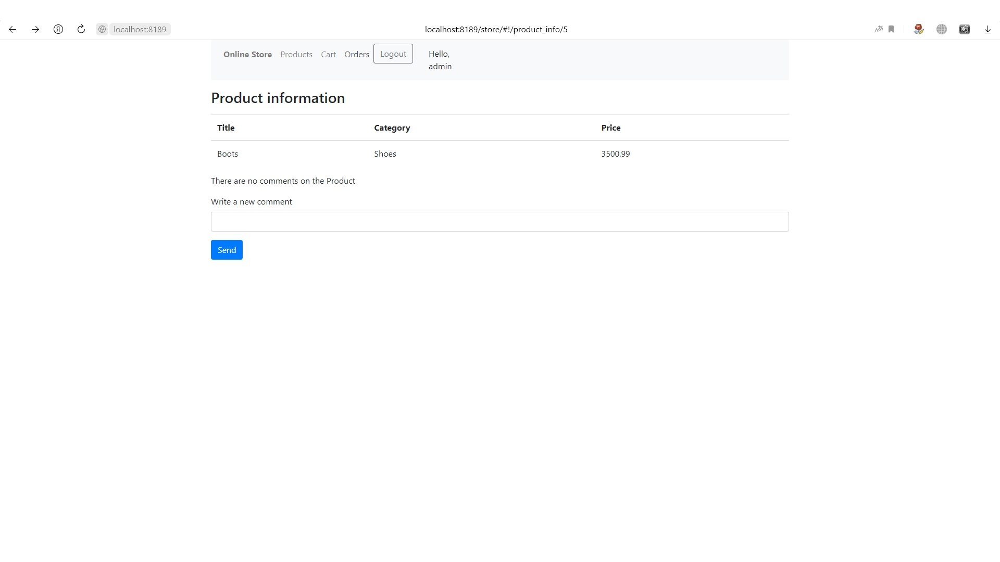

# Проект: Интернет-магазин, созданный с использованием Spring Framework.
___
## Стек: Spring Framework, JSON Web Token, REST API, JSON, AngularJS, Redis, Flyway, H2 Database, SLF4J, Lombok.
___
## Функционал:
___
* Всем пользователям доступен просмотр каталога с товарами.
* Для удобства просмотра, добавлена пагинация страниц.
* Реализована навигация по страницам интернет-магазина.

  
* Всем пользователям доступен просмотр комментариев к товарам.

  
* Всем пользователям доступна возможность добавления и изменения количества 
  товара в корзине.

  
* Существует возможность регистрации и авторизации пользователей.
* Авторизация пользователей осуществляется с помощью токенов.

  
* Авторизованные пользователи получают возможность оформить заказ
  и просматривать уже оформленные заказы.

* Предусмотрено формирование корзины с товаром для каждого пользователя.
* Добавлена возможность фильтрации товаров по названию и цене. 

  
* Реализована возможность добавление комментария к товару при условии,
  что пользователь авторизован и приобретал данный товар.

  
